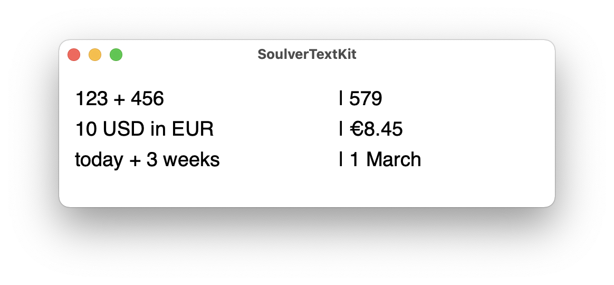

# SoulverTextKit


SoulverTextKit lets you add a line-by-line calculation feature to any NSTextView or UITextView. It uses [SoulverCore](https://soulver.app/core) for number crunching, which also provides unit conversions, date & times calculations, and more.


## Requirements

- Xcode 11+
- Swift 5+

## Supported Platforms

- macOS 10.14.4+
- iOS/iPadOS 13+

## Installation

SoulverTextKit is distributed using the [Swift Package Manager](https://swift.org/package-manager). To install it into a project, simply add it as a dependency within your `Package.swift` manifest:

```swift
let package = Package(
    ...
    dependencies: [
        .package(url: "https://github.com/soulverteam/SoulverTextKit.git", from: "0.0.1")
    ],
    ...
)
```

[Or add the package in Xcode.](https://developer.apple.com/documentation/xcode/adding_package_dependencies_to_your_app)

## Usage

There are 3 steps to integrate SoulverTextKit in your project. Examples for both NSTextView & UITextView are provided in this repository. 

###  Step 1
#### Import SoulverTextKit in your text view delegate

```swift
import SoulverTextKit
```
### Step 2
#### Create an instance variable of ParagraphCalculator and initialize it with your TextView's NSTextStorage and NSTextContainer:

```swift

    @IBOutlet var textView: NSTextView!
    var paragraphCalculator: SoulverTextKit.ParagraphCalculator!

    override func viewDidLoad() {
        super.viewDidLoad()
        self.paragraphCalculator = ParagraphCalculator(answerPosition: .afterEquals, textStorage: self.textView.textStorage, textContainer: self.textView.textContainer)
    }

```

### Step 3
#### Implement NS/UITextView textDidChange and NSLayoutManager didChangeGeometry delegate methods

```swift

    func textDidChange(_ notification: Notification) {
        
        // Let us know when the text changes, so we can evaluate any changed lines if necessary
        paragraphCalculator.textDidChange()
    }
		
    func layoutManager(_ layoutManager: NSLayoutManager, textContainer: NSTextContainer, didChangeGeometryFrom oldSize: NSSize) {

        // Let us know when the text view changes size, so we can change update the formatting if necessary
        paragraphCalculator.layoutDidChange()
    }
```

### Step 4 (optional)
#### Prevent the user editing the result of a paragraph

```swift
    func textView(_ textView: NSTextView, shouldChangeTextIn affectedCharRange: NSRange, replacementString: String?) -> Bool {

        // Check with us to see if the user should be able to edit parts of the paragraph.        
        switch paragraphCalculator.shouldAllowReplacementFor(affectedCharRange: affectedCharRange, replacementString: replacementString) {
        case .allow:
            return true
        case .deny:
            NSSound.beep()
            return false
        case .setIntertionPoint(range: let range):
            textView.setSelectedRange(range)
            return false
        }
        
    }
```


## Styles

There are 3 built-in styles for calculation paragraphs: `afterTab`, `afterPipe` and `afterEquals`. Choose your preferred style when creating the `ParagraphCalculator`.

#### After Tab


#### After Pipe



#### After Equals


## License

Copyright (c) 2021 Zac Cohan. 
SoulverTextKit is distributed under the MIT License. 
The use of the [SoulverCore](https://soulver.app/core) math engine in commercial software requires a special license. You can also modify ParagraphCalculator to use another math engine like [Math.js](https://github.com/josdejong/mathjs) or [Expression](https://github.com/nicklockwood/Expression).